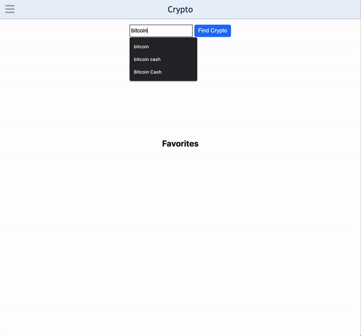

# Crypto

Quickly track prices of cryptocurrencies and save favorites, with up-to-date information

## Technologies Used
- JavaScript
- HTML5
- CSS3

## Live Demo

Try the application live at [https://nickkniola.github.io/crypto/](https://nickkniola.github.io/crypto/)

## Features
- User can search for a cryptocurrency
- User can view current and past prices for cryptocurrency
- User can favorite a cryptocurrency
- User can remove a favorited cryptocurrency

## Preview


## Development

### Getting Started

1. Clone the repository.

    ```shell
    git clone https://github.com/nickkniola/crypto.git
    cd crypto
    ```

2. Open index.html in the browser
